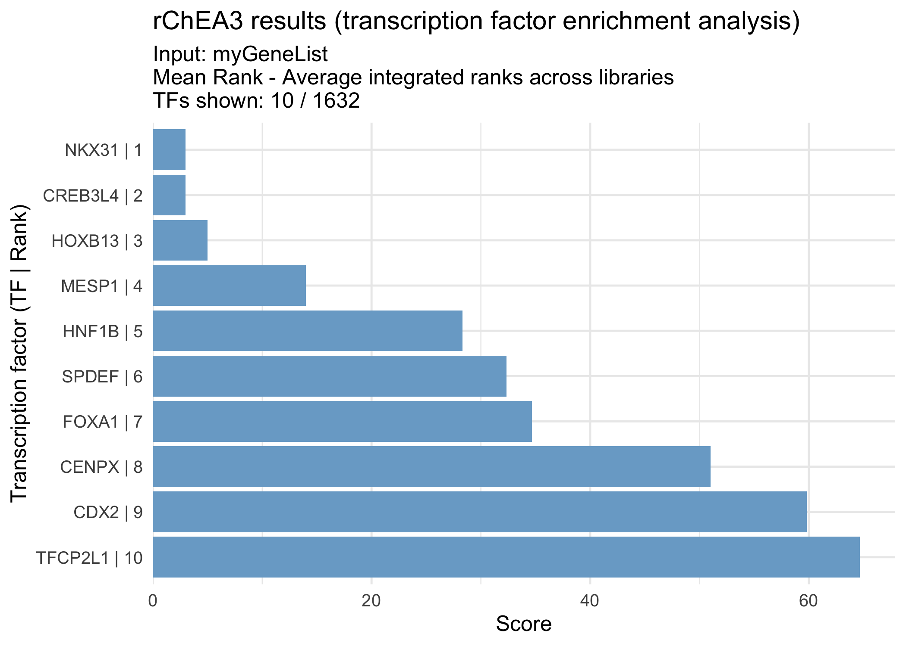

<!-- README.md is generated from README.Rmd. Please edit that file -->

# rChEA3


An R client for the [ChEA3](https://maayanlab.cloud/chea3/)
transcription factor enrichment API.

While ChEA3 is only available online as a web server, rChEA3 provides
access to this tool directly in R, streamlining transcription factor
enrichment into your workflow. Submit gene lists, retrieve TF rankings
from multiple evidence sources (ChIP-seq, co-expression, literature),
and integrate results into your R/Bioconductor analysis pipeline.

The package includes convenient functions to query the API, retrieve
results across collections, prepare outputs for downstream analysis, and
generate publication-ready figures.

## Installation

You can install the development version of rChEA3 from
[GitHub](https://github.com/) with:

``` r
# install.packages("pak")
pak::pak("ckntav/rChEA3")
```

## Quick start

This quick example demonstrates how to conveniently interogate the ChEA3
tool.

``` r
library(rChEA3)
```

### 1. Query ChEA3

``` r
my_gene_list <- c("KLK3", "AR", "FKBP5", "TMPRSS2", "KLK2", "CYP1B1")

results <- queryChEA3(my_gene_list)
#> Available results 
#> ────────────────────────────── 
#>   ► Integrated Results
#>     ✔ Mean Rank — Average integrated ranks across libraries
#>         Use <your_result>[["Integrated--meanRank"]]
#>     ✔ Top Rank — Top integrated rank across libraries
#>         Use <your_result>[["Integrated--topRank"]]
#>   ──────────────────── 
#>   ► ChIP-Seq
#>     ✔ ENCODE — Interactions mined from the ENCODE project
#>         Use <your_result>[["ENCODE--ChIP-seq"]]
#>     ✔ ReMap — Interactions mined from the ReMap project
#>         Use <your_result>[["ReMap--ChIP-seq"]]
#>     ✔ Literature — Interactions mined from the literature
#>         Use <your_result>[["Literature--ChIP-seq"]]
#>   ──────────────────── 
#>   ► Coexpression
#>     ✔ ARCHS4 — TF-target coexpression in the ARCHS4 dataset
#>         Use <your_result>[["ARCHS4--Coexpression"]]
#>     ✔ GTEx — TF-target coexpression in the GTEx dataset
#>         Use <your_result>[["GTEx--Coexpression"]]
#>   ──────────────────── 
#>   ► Co-occurrence
#>     ✔ Enrichr — TF-target co-occurrence in Enrichr queries
#>         Use <your_result>[["Enrichr--Queries"]]
#>   ────────────────────
```

This function sends the query gene list to the ChEA3 web server and
performs the transcription factor enrichment analysis. Once the analysis
is complete, the available results from different collections are
displayed.

### 2. Inspect top results

The function displayTopN() allows quick inspection of the results by
showing the top-ranked transcription factors from each collection. By
default, the top 10 transcription factors are displayed for every
collection, without applying any threshold on score, p-value, or FDR.

``` r
displayTopN(results)
#> Top 10 per collection 
#> ────────────────────────────── 
#>   ► Integrated Results
#>     ✔ Mean Rank - Average integrated ranks across libraries
#>          Rank      TF Score
#>             1   NKX31  3.00
#>             2 CREB3L4  3.00
#>             3  HOXB13  5.00
#>             4   MESP1 14.00
#>             5   HNF1B 28.33
#>             6   SPDEF 32.33
#>             7   FOXA1 34.67
#>             8   CENPX 51.00
#>             9    CDX2 59.80
#>            10 TFCP2L1 64.67
#> 
#>     ✔ Top Rank - Top integrated rank across libraries
#>          Rank      TF     Score
#>             1   NKX31 0.0006143
#>             2 CREB3L4 0.0006223
#>             3 TFCP2L1 0.0007123
#>             4     ERG 0.0012290
#>             5    EVX1 0.0012450
#>             6    TBX3 0.0018430
#>             7  HOXB13 0.0018670
#>             8  ZNF613 0.0021370
#>             9    SIM2 0.0024570
#>            10   GATA2 0.0024890
#> 
#>   ──────────────────── 
#>   ► ChIP-Seq
#>     ✔ ENCODE - Interactions mined from the ENCODE project
#>          Rank     TF Scaled Rank           Set_name Intersect FET p-value FDR
#>             1  NR3C1    0.008475    NR3C1_ECC1_HG19         1     0.06858   1
#>             2   ESR1    0.016950     ESR1_T47D_HG19         1     0.12410   1
#>             3   TCF3    0.025420   TCF3_MYOCYTE_MM9         2     0.12620   1
#>             4   MAFK    0.033900   MAFK_H1HESC_HG19         2     0.13830   1
#>             5 TCF7L2    0.042370 TCF7L2_HEK293_HG19         2     0.13920   1
#>             6  FOSL1    0.050850    FOSL1_K562_HG19         1     0.23320   1
#>             7    SRF    0.059320      SRF_K562_HG19         1     0.24370   1
#>             8   PAX5    0.067800  PAX5_GM12891_HG19         1     0.24440   1
#>             9  STAT1    0.076270  STAT1_HELAS3_HG19         1     0.25430   1
#>            10  MYOD1    0.084750  MYOD1_MYOCYTE_MM9         2     0.25490   1
#>          Odds Ratio
#>              16.420
#>               8.746
#>               3.907
#>               3.680
#>               3.664
#>               4.316
#>               4.099
#>               4.084
#>               3.897
#>               2.396
#> 
#>     ✔ ReMap - Interactions mined from the ReMap project
#>          Rank     TF Scaled Rank Set_name Intersect FET p-value  FDR Odds Ratio
#>             1     AR    0.003367       AR         4    0.003131 0.93      9.224
#>             2 HOXB13    0.006734   HOXB13         3    0.018790 1.00      6.942
#>             3   ATF1    0.010100     ATF1         3    0.018950 1.00      6.918
#>             4   NME2    0.013470     NME2         2    0.097190 1.00      4.609
#>             5  GATA2    0.016840    GATA2         2    0.097190 1.00      4.609
#>             6   SPI1    0.020200     SPI1         2    0.097510 1.00      4.599
#>             7    ERG    0.023570      ERG         2    0.097510 1.00      4.599
#>             8    PGR    0.026940      PGR         2    0.097510 1.00      4.599
#>             9  STAT1    0.030300    STAT1         2    0.097620 1.00      4.596
#>            10 ZNF165    0.033670   ZNF165         1    0.116500 1.00      9.360
#> 
#>     ✔ Literature - Interactions mined from the literature
#>          Rank     TF Scaled Rank                                               Set_name
#>             1     AR    0.006098                        AR_21909140_CHIPSEQ_LNCAP_HUMAN
#>             2  BACH1    0.012200               BACH1_22875853_CHIPPCR_HELAANDSCP4_HUMAN
#>             3   ESR1    0.018290                      ESR1_22446102_CHIPSEQ_UTERI_MOUSE
#>             4   EGR1    0.024390                      EGR1_19374776_CHIPCHIP_THP1_HUMAN
#>             5   ARNT    0.030490                       ARNT_22903824_CHIPSEQ_MCF7_HUMAN
#>             6   TP53    0.036590                       TP53_20018659_CHIPCHIP_R1E_MOUSE
#>             7 HOXD13    0.042680 HOXD13_18407260_CHIPCHIP_INVIVOINDEVELOPINGLIMBS_MOUSE
#>             8   E2F1    0.048780                       E2F1_21310950_CHIPSEQ_MCF7_HUMAN
#>             9   RELA    0.054880               RELA_24523406_CHIPSEQ_FIBROSARCOMA_HUMAN
#>            10   MYCN    0.060980             MYCN_19997598_CHIPCHIP_NEUROBLASTOMA_HUMAN
#>          Intersect FET p-value FDR Odds Ratio
#>                  2    0.005104   1     23.800
#>                  3    0.014370   1      7.720
#>                  3    0.015000   1      7.591
#>                  1    0.023140   1     50.490
#>                  2    0.046470   1      7.159
#>                  2    0.050690   1      6.808
#>                  1    0.057860   1     19.600
#>                  2    0.057900   1      6.299
#>                  2    0.066570   1      5.800
#>                  1    0.070840   1     15.870
#> 
#>   ──────────────────── 
#>   ► Coexpression
#>     ✔ ARCHS4 - TF-target coexpression in the ARCHS4 dataset
#>          Rank      TF Scaled Rank               Set_name Intersect FET p-value      FDR
#>             1   NKX31   0.0006143   NKX31_ARCHS4_PEARSON         5   2.929e-07 0.000477
#>             2     ERG   0.0012290     ERG_ARCHS4_PEARSON         4   8.918e-06 0.001860
#>             3    TBX3   0.0018430    TBX3_ARCHS4_PEARSON         4   9.035e-06 0.001860
#>             4    SIM2   0.0024570    SIM2_ARCHS4_PEARSON         4   9.035e-06 0.001860
#>             5  HOXB13   0.0030710  HOXB13_ARCHS4_PEARSON         4   9.153e-06 0.001860
#>             6 CREB3L4   0.0036860 CREB3L4_ARCHS4_PEARSON         4   9.153e-06 0.001860
#>             7  HOXA13   0.0043000  HOXA13_ARCHS4_PEARSON         4   9.153e-06 0.001860
#>             8   FOXA1   0.0049140   FOXA1_ARCHS4_PEARSON         4   9.153e-06 0.001860
#>             9      AR   0.0055280      AR_ARCHS4_PEARSON         3   2.464e-04 0.034100
#>            10   MESP1   0.0061430   MESP1_ARCHS4_PEARSON         3   2.489e-04 0.034100
#>          Odds Ratio
#>               56.48
#>               45.34
#>               45.18
#>               45.18
#>               45.03
#>               45.03
#>               45.03
#>               45.03
#>               33.89
#>               33.77
#> 
#>     ✔ GTEx - TF-target coexpression in the GTEx dataset
#>          Rank      TF Scaled Rank Set_name Intersect FET p-value     FDR Odds Ratio
#>             1 CREB3L4   0.0006223  CREB3L4         4   8.802e-06 0.00207      45.49
#>             2    EVX1   0.0012450     EVX1         4   8.802e-06 0.00207      45.49
#>             3  HOXB13   0.0018670   HOXB13         4   8.802e-06 0.00207      45.49
#>             4   GATA2   0.0024890    GATA2         4   8.918e-06 0.00207      45.34
#>             5   NKX31   0.0031110    NKX31         4   8.918e-06 0.00207      45.34
#>             6    ISL1   0.0037340     ISL1         4   8.918e-06 0.00207      45.34
#>             7  HOXA13   0.0043560   HOXA13         4   9.035e-06 0.00207      45.18
#>             8  ZNF761   0.0049780   ZNF761         3   2.441e-04 0.02880      34.00
#>             9   GLIS1   0.0056000    GLIS1         3   2.464e-04 0.02880      33.89
#>            10     FEV   0.0062230      FEV         3   2.464e-04 0.02880      33.89
#> 
#>   ──────────────────── 
#>   ► Co-occurrence
#>     ✔ Enrichr - TF-target co-occurrence in Enrichr queries
#>          Rank      TF Scaled Rank Set_name Intersect FET p-value    FDR Odds Ratio
#>             1 TFCP2L1   0.0007123  TFCP2L1         3   0.0002417 0.0802      34.12
#>             2 CREB3L4   0.0014250  CREB3L4         3   0.0002441 0.0802      34.00
#>             3  ZNF613   0.0021370   ZNF613         3   0.0002464 0.0802      33.89
#>             4   ZBED1   0.0028490    ZBED1         2   0.0053500 0.0802      23.22
#>             5  ZNF331   0.0035610   ZNF331         2   0.0054570 0.0802      22.98
#>             6  ZNF600   0.0042740   ZNF600         2   0.0054570 0.0802      22.98
#>             7  ZNF488   0.0049860   ZNF488         2   0.0054930 0.0802      22.90
#>             8   ZNF57   0.0056980    ZNF57         2   0.0054930 0.0802      22.90
#>             9   FOXA2   0.0064100    FOXA2         2   0.0055290 0.0802      22.82
#>            10  HOXB13   0.0071230   HOXB13         2   0.0055290 0.0802      22.82
#> 
#>   ────────────────────
```

### 3. Extract results from a specific collection

The function queryChEA3() returns a list of data frames, one for each
ChEA3 collection. Each element of the list contains transcription
factors (TFs) with their associated statistics (rank, score, p-value, or
FDR depending on the collection).

To access a specific result table, use the variable storing the results
and specify the corresponding collection name. These tables can be
indexed by name, explored, filtered, and integrated into downstream
R/Bioconductor analyses.

As an example, the Mean Rank integrated results can be retrieved with:

``` r
meanRank_results <- results[["Integrated--meanRank"]]
head(meanRank_results)
#>     Query Name Rank      TF Score
#> 1 rChEA3_query    1   NKX31  3.00
#> 2 rChEA3_query    2 CREB3L4  3.00
#> 3 rChEA3_query    3  HOXB13  5.00
#> 4 rChEA3_query    4   MESP1 14.00
#> 5 rChEA3_query    5   HNF1B 28.33
#> 6 rChEA3_query    6   SPDEF 32.33
#>                                                                         Library
#> 1                                     ARCHS4 Coexpression,1;GTEx Coexpression,5
#> 2                   ARCHS4 Coexpression,6;Enrichr Queries,2;GTEx Coexpression,1
#> 3 ARCHS4 Coexpression,5;Enrichr Queries,10;ReMap ChIP-seq,2;GTEx Coexpression,3
#> 4                ARCHS4 Coexpression,10;Enrichr Queries,16;GTEx Coexpression,16
#> 5                   ARCHS4 Coexpression,32;Enrichr Queries,21;ReMap ChIP-seq,32
#> 6                ARCHS4 Coexpression,11;Enrichr Queries,75;GTEx Coexpression,11
#>                   Overlapping_Genes
#> 1        AR,TMPRSS2,KLK3,KLK2,FKBP5
#> 2 AR,TMPRSS2,CYP1B1,KLK3,KLK2,FKBP5
#> 3       AR,TMPRSS2,CYP1B1,KLK3,KLK2
#> 4       AR,TMPRSS2,CYP1B1,KLK3,KLK2
#> 5                    CYP1B1,TMPRSS2
#> 6       AR,TMPRSS2,CYP1B1,KLK3,KLK2
```

This table contains the averaged ranks of transcription factors across
all ChEA3 libraries, providing a global view of TF enrichment for your
gene set.

#### 4. Visualize results

The function visualizeRank() creates a bar plot of the top-ranked
transcription factors from a result table. By default, the plot displays
the most significant TFs in descending order, making it easy to quickly
identify the strongest candidates for your gene list.

``` r
visualizeRank(meanRank_results)
```



## Contributing

Pull requests are welcome. If you find a bug, have a suggestion, or want
to add a feature, please open an issue first to discuss what you would
like to change.

## Citation

If you use this package, please cite:

Keiichiro D. et al. (2019). ChEA3: transcription factor enrichment
analysis by orthogonal omics integration. Nucleic Acids Research,
47(W1), W212–W224.
