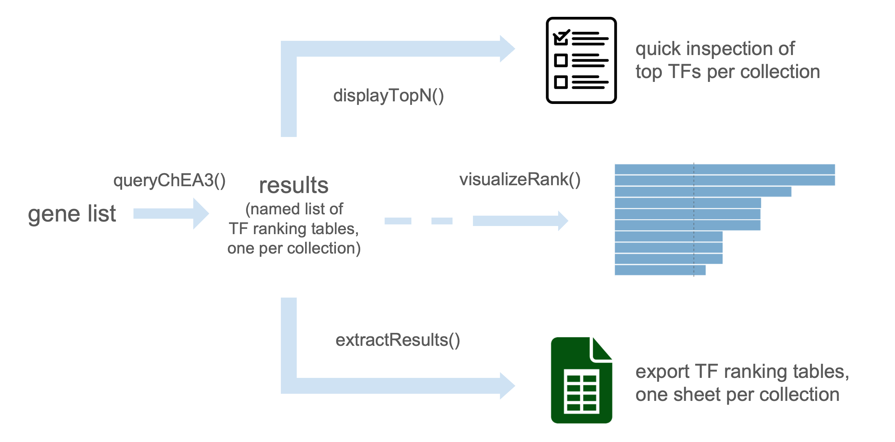
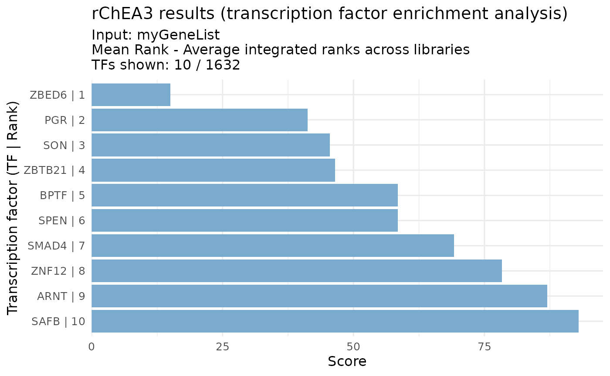

# rChEA3: An R client for ChEA3 transcription factor enrichment API

## Introduction

rChEA3 is an R client for the [ChEA3](https://maayanlab.cloud/chea3/)
transcription factor enrichment API.

While ChEA3 is only available online as a web server, rChEA3 provides
access to this tool directly in R, streamlining transcription factor
enrichment into your workflow. Submit gene lists, retrieve TF rankings
from multiple evidence sources (ChIP-seq, co-expression, literature),
and integrate results into your R/Bioconductor analysis pipeline.

The package includes convenient functions to query the API, retrieve
results across collections, prepare outputs for downstream analysis, and
generate publication-ready figures.

  
  

## Installation

#### From CRAN (stable version)

``` r

install.packages("rChEA3")
```

#### From GitHub (development version)

You can install the development version of rChEA3 from
[GitHub](https://github.com/) with:

``` r

# install.packages("pak")  # if not already installed
pak::pak("ckntav/rChEA3")

# or, alternatively:
# install.packages("devtools")  # if not already installed
devtools::install_github("ckntav/rChEA3")
```

  

## Example workflow

This section demonstrates a typical workflow with rChEA3, from
submitting a gene list to retrieving transcription factor enrichment
results. The examples illustrate how to interact with the ChEA3 API,
explore the different collections, and visualize results in a clear,
publication-ready format.

We start by loading the package:

``` r

library(rChEA3)
```

### 1. Submit a gene list

Provide a vector of gene symbols as input. The gene list should consist
of [HGNC](https://www.genenames.org)-approved gene symbols, as ChEA3
only accepts these standardized gene identifiers.

``` r

genes <- c("TP53", "ESR1", "MYC", "NIPBL", "BRCA1")
results <- queryChEA3(genes)
#> Available results 
#> ────────────────────────────── 
#>   ► Integrated Results
#>     ✔ Mean Rank — Average integrated ranks across libraries
#>         Use <your_result>[["Integrated--meanRank"]]
#>     ✔ Top Rank — Top integrated rank across libraries
#>         Use <your_result>[["Integrated--topRank"]]
#>   ──────────────────── 
#>   ► ChIP-Seq
#>     ✔ ENCODE — Interactions mined from the ENCODE project
#>         Use <your_result>[["ENCODE--ChIP-seq"]]
#>     ✔ ReMap — Interactions mined from the ReMap project
#>         Use <your_result>[["ReMap--ChIP-seq"]]
#>     ✔ Literature — Interactions mined from the literature
#>         Use <your_result>[["Literature--ChIP-seq"]]
#>   ──────────────────── 
#>   ► Coexpression
#>     ✔ ARCHS4 — TF-target coexpression in the ARCHS4 dataset
#>         Use <your_result>[["ARCHS4--Coexpression"]]
#>     ✔ GTEx — TF-target coexpression in the GTEx dataset
#>         Use <your_result>[["GTEx--Coexpression"]]
#>   ──────────────────── 
#>   ► Co-occurrence
#>     ✔ Enrichr — TF-target co-occurrence in Enrichr queries
#>         Use <your_result>[["Enrichr--Queries"]]
#>   ────────────────────
```

By default, the query is sent to the public ChEA3 API
(`https://maayanlab.cloud/chea3/api/enrich/`). If you run a local or
self-hosted ChEA3 instance (see the [ChEA3 source
repository](https://github.com/MaayanLab/chea3)), pass its endpoint
through the `url` argument:

``` r

results <- queryChEA3(genes, url = "http://localhost:8080/chea3/api/enrich/")
```

The URL must point to the full `enrich/` endpoint.

> **Note:** For detailed information about the different ChEA3
> collections and their underlying methodology, see [Keenan et al.,
> 2019](https://doi.org/10.1093/nar/gkz446).

### 2. Inspect top results

The function displayTopN() allows a quick inspection of the results by
showing the top transcription factors from each collection. By default,
the top 10 transcription factors are displayed without applying
thresholds.

``` r

displayTopN(results)
#> Top 10 per collection 
#> ────────────────────────────── 
#>   ► Integrated Results
#>     ✔ Mean Rank - Average integrated ranks across libraries
#>          Rank     TF Score
#>             1  ZBED6 15.00
#>             2    PGR 41.25
#>             3    SON 45.50
#>             4 ZBTB21 46.50
#>             5   BPTF 58.50
#>             6   SPEN 58.50
#>             7  SMAD4 69.20
#>             8  ZNF12 78.33
#>             9   ARNT 87.00
#>            10   SAFB 93.00
#> 
#>     ✔ Top Rank - Top integrated rank across libraries
#>          Rank      TF     Score
#>             1 TGIF2LY 0.0006143
#>             2  ZNF800 0.0006223
#>             3   CREB1 0.0007123
#>             4  RHOXF1 0.0012290
#>             5  HIVEP1 0.0012450
#>             6    NFYA 0.0014250
#>             7  ZNF654 0.0018430
#>             8    OSR2 0.0018670
#>             9     SP1 0.0021370
#>            10     BBX 0.0024570
#> 
#>   ──────────────────── 
#>   ► ChIP-Seq
#>     ✔ ENCODE - Interactions mined from the ENCODE project
#>          Rank     TF Scaled Rank               Set_name Intersect FET p-value   FDR
#>             1  CEBPB    0.008475        CEBPB_C2C12_MM9         3    0.009772 0.717
#>             2 ZNF217    0.016950       ZNF217_MCF7_HG19         3    0.012720 0.717
#>             3   CTCF    0.025420        CTCF_HEPG2_HG19         4    0.017380 0.717
#>             4  CEBPD    0.033900        CEBPD_K562_HG19         2    0.018070 0.717
#>             5 ZNF384    0.042370      ZNF384_CH12LX_MM9         3    0.019260 0.717
#>             6   ATF2    0.050850       ATF2_H1HESC_HG19         3    0.021370 0.717
#>             7   RELA    0.059320      RELA_GM12878_HG19         2    0.022770 0.717
#>             8   FLI1    0.067800 FLI1_MEGAKARYOCYTE_MM9         3    0.024120 0.717
#>             9    YY1    0.076270       YY1_GM12892_HG19         2    0.031250 0.717
#>            10   JUND    0.084750       JUND_H1HESC_HG19         3    0.037140 0.717
#>          Odds Ratio
#>               9.358
#>               8.449
#>               5.697
#>              12.580
#>               7.167
#>               6.871
#>              11.080
#>               6.541
#>               9.289
#>               5.463
#> 
#>     ✔ ReMap - Interactions mined from the ReMap project
#>          Rank     TF Scaled Rank Set_name Intersect FET p-value   FDR Odds Ratio
#>             1  CXXC4    0.003367    CXXC4         3     0.01325 0.911      8.314
#>             2   MBD3    0.006734     MBD3         2     0.07561 0.911      5.558
#>             3  KMT2B    0.010100    KMT2B         2     0.07561 0.911      5.558
#>             4   RFX2    0.013470     RFX2         2     0.07569 0.911      5.554
#>             5   MBD4    0.016840     MBD4         2     0.07578 0.911      5.550
#>             6  EOMES    0.020200    EOMES         2     0.07578 0.911      5.550
#>             7   TBXT    0.023570     TBXT         2     0.07604 0.911      5.539
#>             8   XBP1    0.026940     XBP1         2     0.07613 0.911      5.535
#>             9 ZBTB33    0.030300   ZBTB33         2     0.07621 0.911      5.531
#>            10  FOXA1    0.033670    FOXA1         2     0.07621 0.911      5.531
#> 
#>     ✔ Literature - Interactions mined from the literature
#>          Rank     TF Scaled Rank                                              Set_name
#>             1   ESR1    0.006098                     ESR1_15608294_CHIPCHIP_MCF7_HUMAN
#>             2   E2F4    0.012200                   E2F4_17652178_CHIPCHIP_JURKAT_HUMAN
#>             3  BACH1    0.018290              BACH1_22875853_CHIPPCR_HELAANDSCP4_HUMAN
#>             4  PPARD    0.024390                 PPARD_23208498_CHIPSEQ_MDAMB231_HUMAN
#>             5    JUN    0.030490                       JUN_21703547_CHIPSEQ_K562_HUMAN
#>             6   E2F7    0.036590                      E2F7_22180533_CHIPSEQ_HELA_HUMAN
#>             7   CUX1    0.042680 CUX1_19635798_CHIPCHIP_MULTIPLEHUMANCANCERTYPES_HUMAN
#>             8  NANOG    0.048780                    NANOG_18347094_CHIPCHIP_MESC_MOUSE
#>             9 POU3F1    0.054880                     POU3F1_26484290_CHIPSEQ_ESC_MOUSE
#>            10   EGR1    0.060980                     EGR1_19374776_CHIPCHIP_THP1_HUMAN
#>          Intersect FET p-value   FDR Odds Ratio
#>                  2    0.000384 0.118     94.090
#>                  3    0.003138 0.482     14.330
#>                  3    0.010030 0.494      9.264
#>                  2    0.010610 0.494     16.770
#>                  3    0.013300 0.494      8.302
#>                  1    0.013400 0.494     90.890
#>                  4    0.016600 0.494      5.783
#>                  3    0.016690 0.494      7.588
#>                  3    0.019720 0.494      7.099
#>                  1    0.019870 0.494     60.590
#> 
#>   ──────────────────── 
#>   ► Coexpression
#>     ✔ ARCHS4 - TF-target coexpression in the ARCHS4 dataset
#>          Rank      TF Scaled Rank               Set_name Intersect FET p-value FDR
#>             1 TGIF2LY   0.0006143 TGIF2LY_ARCHS4_PEARSON         2    0.004325   1
#>             2  RHOXF1   0.0012290  RHOXF1_ARCHS4_PEARSON         2    0.004352   1
#>             3  ZNF654   0.0018430  ZNF654_ARCHS4_PEARSON         1    0.084660   1
#>             4     BBX   0.0024570     BBX_ARCHS4_PEARSON         1    0.084660   1
#>             5  ZNF407   0.0030710  ZNF407_ARCHS4_PEARSON         1    0.084660   1
#>             6     RLF   0.0036860     RLF_ARCHS4_PEARSON         1    0.084660   1
#>             7  ZNF552   0.0043000  ZNF552_ARCHS4_PEARSON         1    0.084660   1
#>             8     YY2   0.0049140     YY2_ARCHS4_PEARSON         1    0.084660   1
#>             9    REST   0.0055280    REST_ARCHS4_PEARSON         1    0.084660   1
#>            10  ZBTB24   0.0061430  ZBTB24_ARCHS4_PEARSON         1    0.084930   1
#>          Odds Ratio
#>               26.93
#>               26.84
#>               13.51
#>               13.51
#>               13.51
#>               13.51
#>               13.51
#>               13.51
#>               13.51
#>               13.46
#> 
#>     ✔ GTEx - TF-target coexpression in the GTEx dataset
#>          Rank      TF Scaled Rank Set_name Intersect FET p-value   FDR Odds Ratio
#>             1  ZNF800   0.0006223   ZNF800         3   0.0001677 0.136      40.53
#>             2  HIVEP1   0.0012450   HIVEP1         3   0.0001694 0.136      40.39
#>             3    OSR2   0.0018670     OSR2         2   0.0042690 0.538      27.11
#>             4   ADNP2   0.0024890    ADNP2         2   0.0043250 0.538      26.93
#>             5   NCOA3   0.0031110    NCOA3         2   0.0043520 0.538      26.84
#>             6 ZSCAN25   0.0037340  ZSCAN25         2   0.0043520 0.538      26.84
#>             7  ZNF317   0.0043560   ZNF317         2   0.0043520 0.538      26.84
#>             8   KLF11   0.0049780    KLF11         2   0.0043520 0.538      26.84
#>             9 ZNF705E   0.0056000  ZNF705E         2   0.0043520 0.538      26.84
#>            10     SP1   0.0062230      SP1         2   0.0043520 0.538      26.84
#> 
#>   ──────────────────── 
#>   ► Co-occurrence
#>     ✔ Enrichr - TF-target co-occurrence in Enrichr queries
#>          Rank    TF Scaled Rank Set_name Intersect FET p-value      FDR Odds Ratio
#>             1 CREB1   0.0007123    CREB1         5   1.539e-07 4.39e-05      68.48
#>             2  NFYA   0.0014250     NFYA         5   1.539e-07 4.39e-05      68.48
#>             3   SP1   0.0021370      SP1         5   1.565e-07 4.39e-05      68.24
#>             4 SMAD4   0.0028490    SMAD4         5   1.565e-07 4.39e-05      68.24
#>             5  ATF2   0.0035610     ATF2         5   1.565e-07 4.39e-05      68.24
#>             6   SRY   0.0042740      SRY         4   5.135e-06 2.57e-04      55.16
#>             7 MYOD1   0.0049860    MYOD1         4   5.204e-06 2.57e-04      54.97
#>             8    AR   0.0056980       AR         4   5.204e-06 2.57e-04      54.97
#>             9   CRX   0.0064100      CRX         4   5.204e-06 2.57e-04      54.97
#>            10 NR5A1   0.0071230    NR5A1         4   5.204e-06 2.57e-04      54.97
#> 
#>   ────────────────────
```

### 3. Extract the result for one particular collection

Each ChEA3 collection can be accessed by name. For example, to retrieve
the integrated ranking:

``` r

meanRank_results <- results[["Integrated--meanRank"]]
head(meanRank_results)
#>     Query Name Rank     TF Score
#> 1 rChEA3_query    1  ZBED6 15.00
#> 2 rChEA3_query    2    PGR 41.25
#> 3 rChEA3_query    3    SON 45.50
#> 4 rChEA3_query    4 ZBTB21 46.50
#> 5 rChEA3_query    5   BPTF 58.50
#> 6 rChEA3_query    6   SPEN 58.50
#>                                                                            Library
#> 1                                                           ARCHS4 Coexpression,15
#> 2 ARCHS4 Coexpression,24;Enrichr Queries,11;ReMap ChIP-seq,84;GTEx Coexpression,46
#> 3                                      ARCHS4 Coexpression,60;GTEx Coexpression,31
#> 4                                      ARCHS4 Coexpression,26;GTEx Coexpression,67
#> 5                                      ARCHS4 Coexpression,68;GTEx Coexpression,49
#> 6                                      ARCHS4 Coexpression,22;GTEx Coexpression,95
#>     Overlapping_Genes
#> 1               NIPBL
#> 2 MYC,BRCA1,ESR1,TP53
#> 3               NIPBL
#> 4           NIPBL,MYC
#> 5               NIPBL
#> 6               NIPBL
```

### 4. Generate the visualization

``` r

visualizeRank(meanRank_results)
```



## Session info

``` r

sessionInfo()
#> R version 4.6.0 (2026-04-24)
#> Platform: x86_64-pc-linux-gnu
#> Running under: Ubuntu 24.04.4 LTS
#> 
#> Matrix products: default
#> BLAS:   /usr/lib/x86_64-linux-gnu/openblas-pthread/libblas.so.3 
#> LAPACK: /usr/lib/x86_64-linux-gnu/openblas-pthread/libopenblasp-r0.3.26.so;  LAPACK version 3.12.0
#> 
#> locale:
#>  [1] LC_CTYPE=C.UTF-8       LC_NUMERIC=C           LC_TIME=C.UTF-8       
#>  [4] LC_COLLATE=C.UTF-8     LC_MONETARY=C.UTF-8    LC_MESSAGES=C.UTF-8   
#>  [7] LC_PAPER=C.UTF-8       LC_NAME=C              LC_ADDRESS=C          
#> [10] LC_TELEPHONE=C         LC_MEASUREMENT=C.UTF-8 LC_IDENTIFICATION=C   
#> 
#> time zone: UTC
#> tzcode source: system (glibc)
#> 
#> attached base packages:
#> [1] stats     graphics  grDevices utils     datasets  methods   base     
#> 
#> other attached packages:
#> [1] rChEA3_1.0.0
#> 
#> loaded via a namespace (and not attached):
#>  [1] gtable_0.3.6       jsonlite_2.0.0     dplyr_1.2.1        compiler_4.6.0    
#>  [5] crayon_1.5.3       tidyselect_1.2.1   jquerylib_0.1.4    scales_1.4.0      
#>  [9] systemfonts_1.3.2  textshaping_1.0.5  yaml_2.3.12        fastmap_1.2.0     
#> [13] ggplot2_4.0.3      R6_2.6.1           labeling_0.4.3     generics_0.1.4    
#> [17] curl_7.1.0         knitr_1.51         tibble_3.3.1       desc_1.4.3        
#> [21] lubridate_1.9.5    RColorBrewer_1.1-3 bslib_0.11.0       pillar_1.11.1     
#> [25] rlang_1.2.0        cachem_1.1.0       xfun_0.57          S7_0.2.2          
#> [29] fs_2.1.0           sass_0.4.10        timechange_0.4.0   cli_3.6.6         
#> [33] pkgdown_2.2.0      withr_3.0.2        magrittr_2.0.5     digest_0.6.39     
#> [37] grid_4.6.0         lifecycle_1.0.5    vctrs_0.7.3        evaluate_1.0.5    
#> [41] glue_1.8.1         farver_2.1.2       ragg_1.5.2         rmarkdown_2.31    
#> [45] httr_1.4.8         tools_4.6.0        pkgconfig_2.0.3    htmltools_0.5.9
```

## Citation

If you use this package, please cite:

Keenan, A.B., Torre, D., Lachmann, A., Leong, A.K., Wojciechowicz, M.L.,
Utti, V., Jagodnik, K.M., Kropiwnicki, E., Wang, Z., & Ma’ayan, A.
(2019). ChEA3: transcription factor enrichment analysis by orthogonal
omics integration. *Nucleic Acids Research*, 47(W1), W212–W224.
[doi:10.1093/nar/gkz446](https://doi.org/10.1093/nar/gkz446)

## Resources

- [ChEA3 Web Server](https://maayanlab.cloud/chea3/) - Interactive tool
  and detailed documentation
- [ChEA3 Publication](https://doi.org/10.1093/nar/gkz446) - Original
  research article
- [rChEA3 GitHub](https://github.com/ckntav/rChEA3) - Package source
  code and issues
